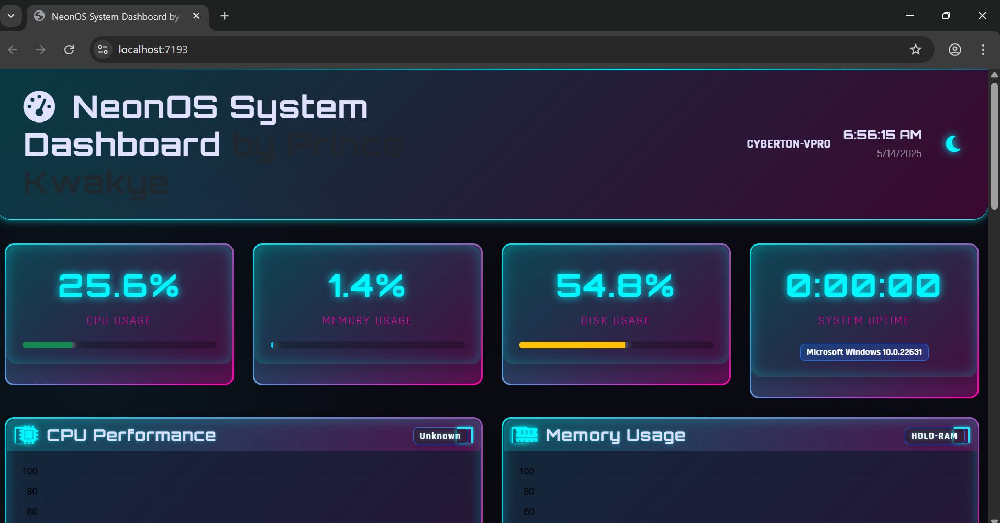
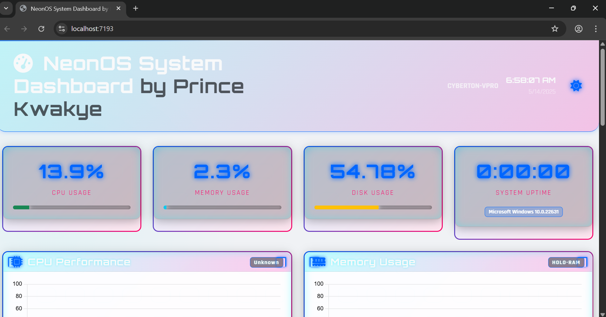
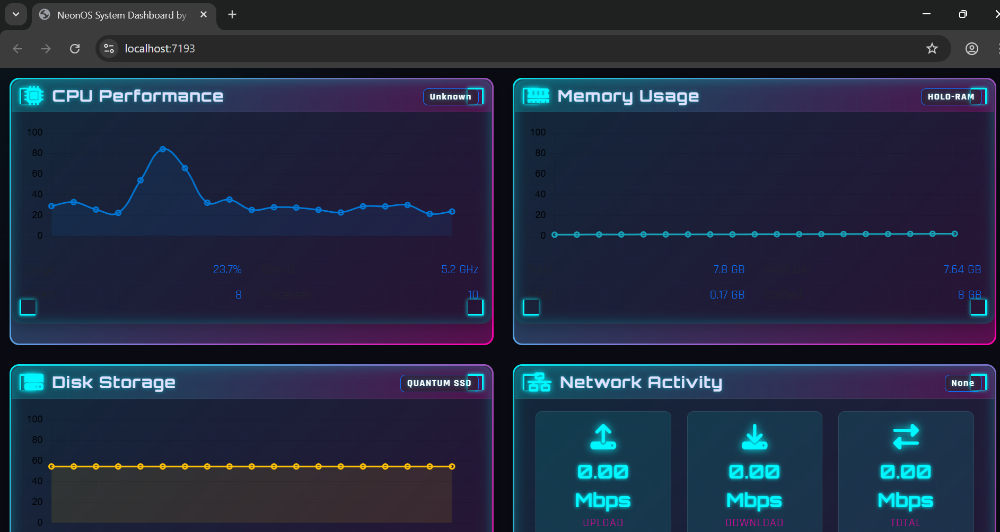
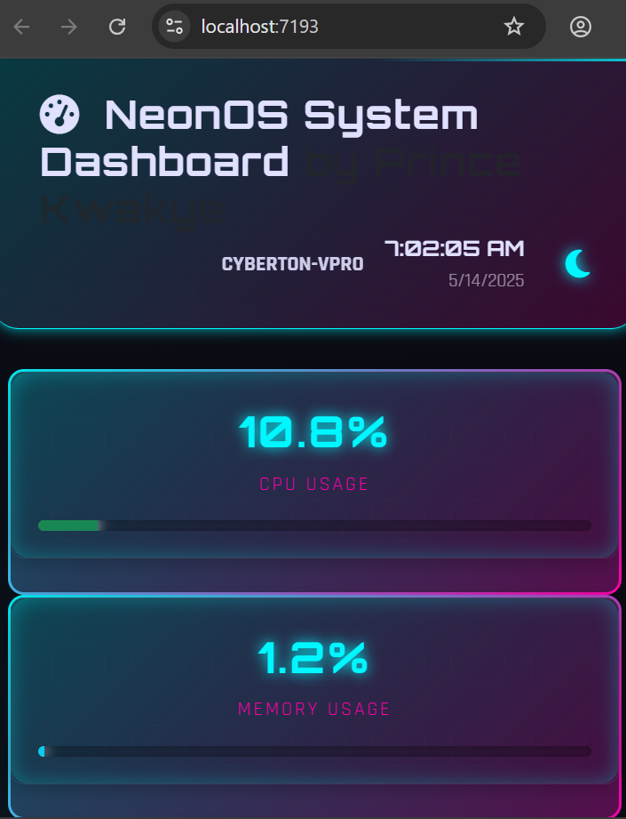
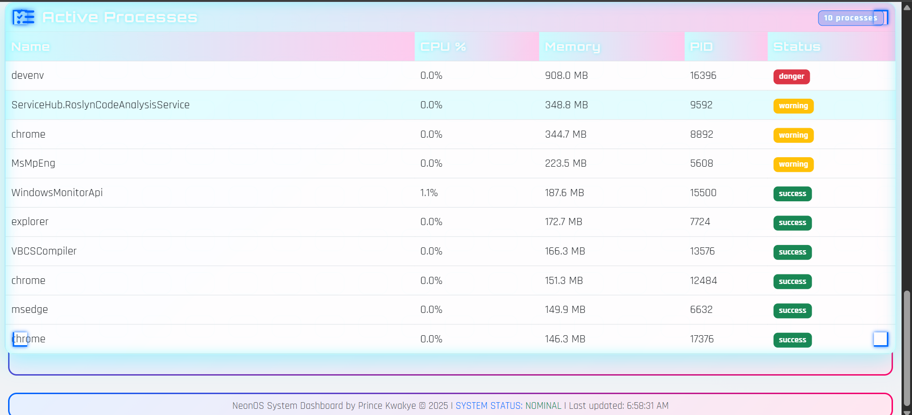

# Windows 11 System Dashboard by Prince Kwakye

 

A professional system monitoring dashboard for Windows 11 that displays real-time CPU, memory, disk, and network usage statistics with beautiful visualizations.

## Features

- **Real-time Monitoring**:
  - CPU usage and performance metrics
  - Memory allocation and utilization
  - Disk storage and health indicators
  - Network upload/download speeds

- **Interactive Visualizations**:
  - Live-updating charts with historical data
  - Process management table
  - Responsive progress indicators

- **User Experience**:
  - Dark/light mode toggle
  - Mobile-responsive design
  - Self-updating every 2 seconds

- **Technical Highlights**:
  - ASP.NET Core backend with efficient polling
  - Modern frontend with Bootstrap 5
  - Chart.js for beautiful visualizations
  - Cross-platform compatibility

## Technologies Used

**Frontend**:
- HTML5, CSS3, JavaScript
- Bootstrap 5
- Chart.js
- Font Awesome

**Backend**:
- ASP.NET Core
- C#
- System Performance Counters
- Windows Management Instrumentation (WMI)

## Screenshots



*Dashboard in light mode*


*Dashboard in dark mode*


*Responsive mobile layout*


*Process activity visualization in light-mode*

## Getting Started

### Prerequisites

- Windows 11 machine
- .NET 6.0 or later SDK
- Modern web browser (Chrome, Edge, Firefox)

### Installation

1. Clone the repository:
   ```bash
   git clone https://github.com/Prince-Kwakye/WindowsMonitor.git
   cd WindowsMonitor
## License
This project is licensed under the [MIT License](LICENSE.txt).

## Author
Prince Kwakye(https://github.com/Prince-Kwakye)
